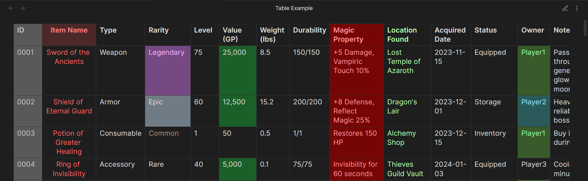
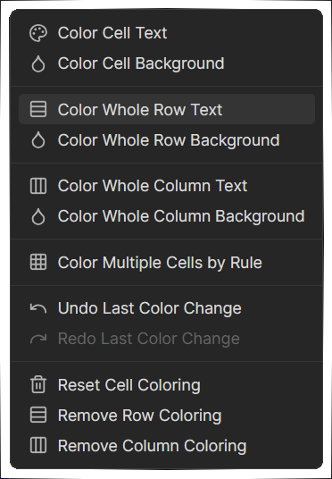
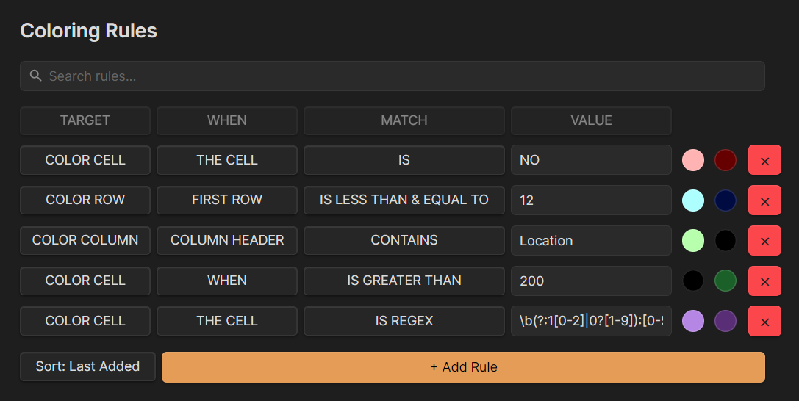
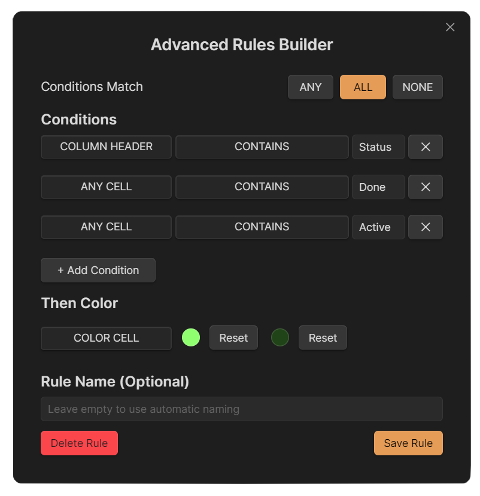
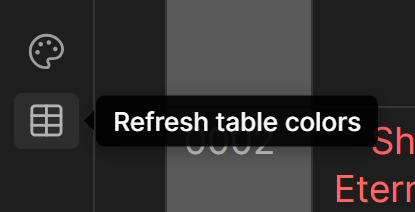
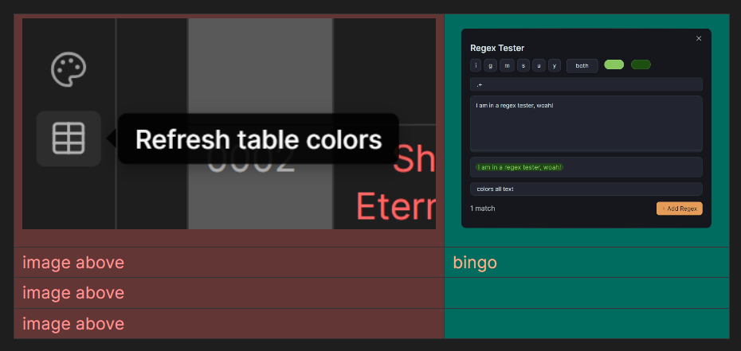

# Color Table Cells
Color any table cell in Obsidian. 
Supports both manual coloring and automatic rules based on text, numbers, and regex.



By default, colors appear in **Reading Mode**.
You can enable coloring in **Live Preview Mode** from settings.

## Manual Coloring

1. Switch to **Reading Mode**
2. **Right click**- any table cell
3. Pick a background or text color



Currently, the manual coloring is a bit unstable, and the coloring does not always apply properly across views. ***The rule based coloring works much more reliably.*** 

> For best experience, I'd recommend not introducing manual colors in a rule-based coloring table.


## Automatic Coloring with Rules

Rules let you color cells, rows, or entire columns automatically based on what they contain.


No more manual formatting for large tables!

### Simple Rules

A simple rule uses a single condition of these properties:

**TARGET**
What gets colored
- Color cell
- Color row
- Color column

**WHEN**
Where the plugin checks
- Any cell
- All cells
- No cell
- First row
- Column header

**MATCH**
How the comparison works
- Is
- Is not
- Is Regex
- Contains
- Does not contain
- Starts with
- Ends with
- Does not start with
- Does not end with
- Is empty
- Is not empty
- Is greater than
- Is less than
- Is greater than or equal to
- Is less than or equal to

**VALUE**
What it looks for: text, number, or regex pattern

**COLOR**
Your background and text color (Null by Default).

**Example**
To highlight all cells that contain URGENT:
- Target: Color cell
- When: Any cell
- Match: Contains
- Value: URGENT
- Color: Red background, white text


## Advanced Rules

Advanced rules let you stack multiple conditions together.
The conditions you set (Any, All, or None) must match before the rule applies.



**Example**
Color a cell green only when:
- It contains a number
- The number is greater than 100

### Refreshing Table Colors
Changes you make in the plugin settings apply immediately. If you ever see outdated colors due to Obsidian not updating the table view, you can force a refresh using the table colors refresh button in the ribbon or the status bar icon.



<!-- 
## How Single Cell Coloring Works

Every colored cell is saved in a small `data.json` file.
The plugin remembers exactly which file, table, row, and column it belongs to, and restores it automatically when you reopen the note.

**Example `data.json`**

```json
{
  "settings": { ... },
  "cellData": {
    "Notes/Math.md": {
      "table_0": {
        "row_1": {
          "col_2": {
            "bg": "#FF9494",
            "color": "#000000"
          }
        }
      }
    }
  }
}
```

This tells the plugin:
In `Math.md`, table 0, row 1, column 2 has:

- Background: #FF9494
- Text: #000000
 -->

## Installation
This plugin is currently NOT in Obsidian Community Plugins.


For manual installation, download the main.js, styles.css and manifest.json files from [Releases](https://github.com/Kazi-Aidah/color-table-cells/issues/3) and create a folder with the name "color-table-cells" in your vault/.obsidian/plugins/ folder and put the files there.

### Mobile Support
Yes. Everything works on Obsidian Mobile.
Manual coloring and rule based coloring both apply normally.

### Cool Stuff
Allows image embed / hyperlink as the match for column headers for coloring too!
